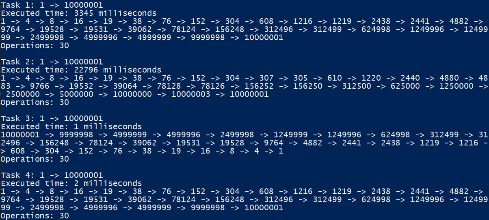
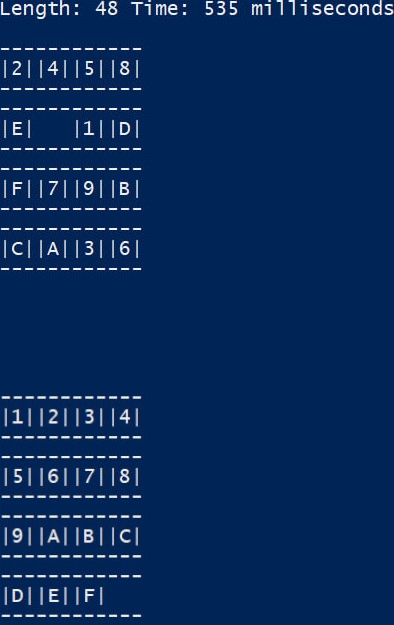
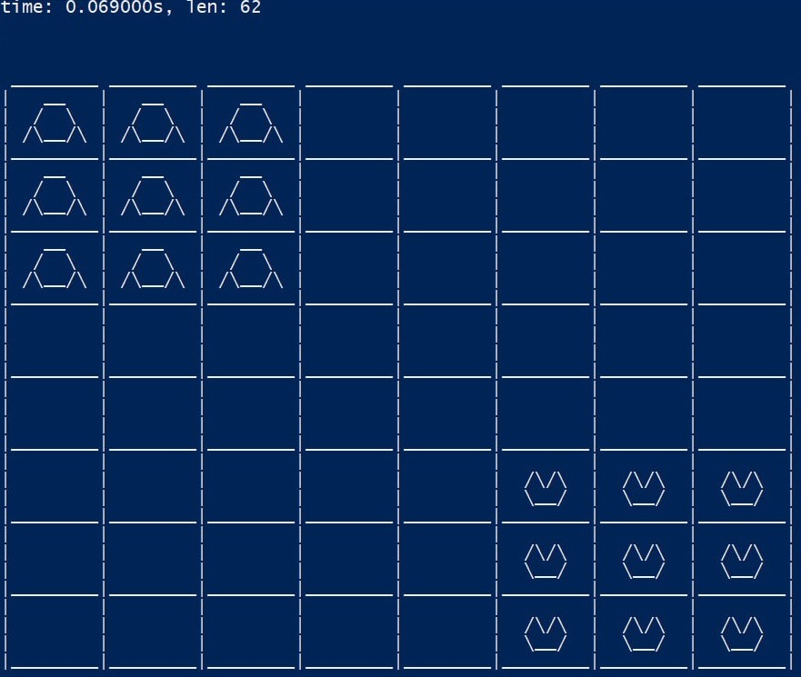
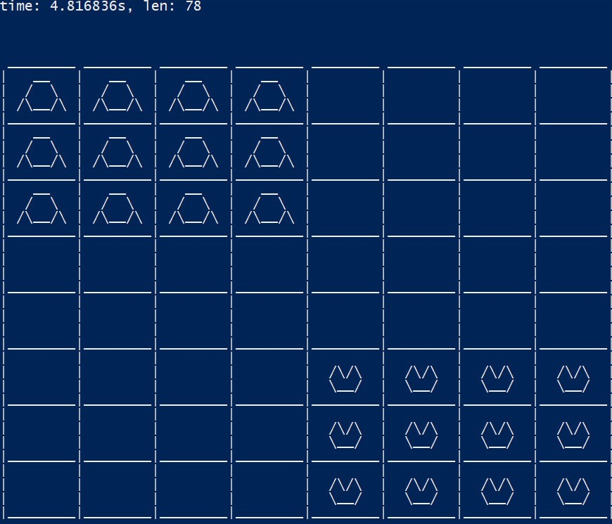

# Intelligent-Systems-Labs

# Лабораторная 1

Поиск решения в пространстве состояний

Решить вводные задачи поиска:

1) Даны два целых числа – например, 2 и 100, а также две операции – «прибавить 3» и «умножить на 2». Найти минимальную последовательность операций, позволяющую получить из первого числа второе.
2) То же самое, что и в пункте 1, однако добавляется операция «вычесть 2».
3) Реализовать задание из пункта 1 методом обратного поиска – от целевого состояния к начальному. Сравнить эффективность.
4) Дополнительное задание. Реализовать метод двунаправленного поиска для решения задачи из пункта 1.

`g++ -o lab1 lab1.cpp`, `./lab1 `, 

# Лабораторная 2

Игра "Пятнашки".

## Лаба 3
«Уголки». На шахматной доске расположено 12 белых шашек, и двенадцать черных.
Белые в прямоугольнике A1-D3, черные симметрично относительно центра. Шашки
могут перепрыгивать друг через друга (по горизонтали, вертикали и диагонали), либо перемещаться на 1 клетку (аналогично, по горизонтали, вертикали и диагонали). За минимальное число ходов достичь обратного расположения шашек

`g++ -o lab3_3x3 lab3_3x3.cpp -O2 -std=c++11` - пример с оптимизацией и без проверок

почему не использовал стандартный шаблон array для эвристики

## Лаба 4
Интерфейс можно сделать и получше, но мне лень... Если лишнее не тыкать - работает хорошо ;)

# TODO
Надо файл для сборки настроить - дебага и релиза - для vs code
Комментарии надо
#### Лаба 2 
- Состояние - массив чаров
- Хэш в пройденных значениях - как сдвиг, строка - однозначное отображение
- Эвристику не пересчитывать каждый раз - там отличие на 1

#### Лаба 4
- Интерфейс переделать немного, когда нажимаешь на место, которое занято - всё может испортиться (Только в режиме игры с ботом)